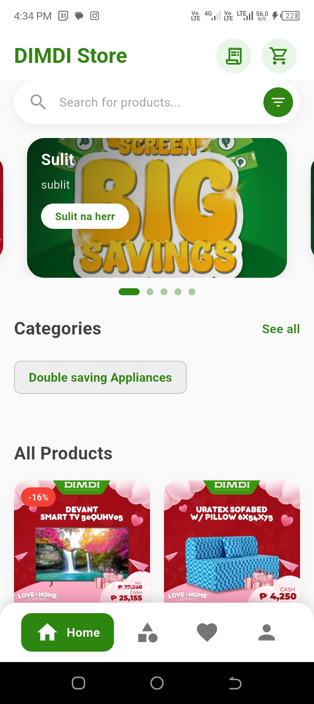
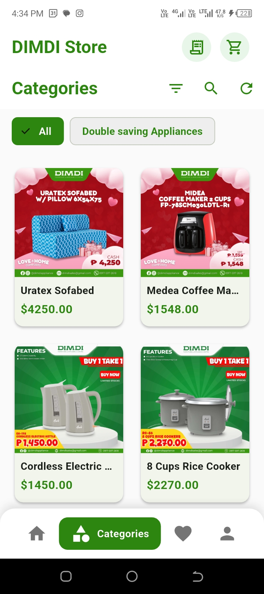
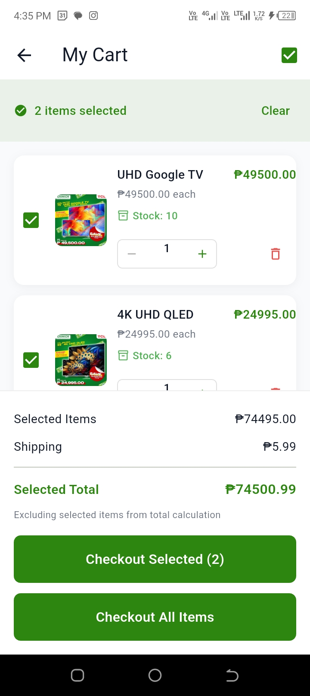

# Flutter_E-Commerece_Dimdi 

This is a Laravel Project for IT-14 E-Commerce Subsystem   December 16, 2025

___

<h1>The Program Overall</h1>

___

<h3>Customer Side</h3>

  

  
  
  

  
  
  

___

<h3>Admin Side</h3>

  

___

<h3>Rider Side</h3>
